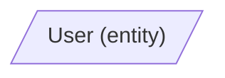

# CGD Response Standard v1.3

## Purpose

This standard defines the format of a structured model response when designing software systems within the CGD (Controlled Generative Development) approach. The standard ensures comparability of responses across models, binary completeness checking, and the possibility of automated verification.

## Principle

The standard implements contract-first at the level of communication with the model. The model receives a contract for the response format before solving the task. A violation of the format is visible without expert interpretation.

## Structure of the response

The response consists of two mandatory sections. Each section begins with a second-level heading (`##`) and contains exactly one fenced block. Text outside these sections is not allowed.

| Section | Format | Purpose |
| --- | --- | --- |
| Mermaid | `flowchart LR` | Typed directed graph: nodes (functions and tables), edges (`consumes`, `produces`, `reads`, `writes`, `triggers`), and the visual topology of the system |
| CGD Specification | JSON | Full system description: functions (YASF profile + contracts) and tables (CGD Table Schema Profile) |

---

## Section 1: Mermaid

### Format

Only `flowchart LR` is allowed. Other Mermaid diagram types (`erDiagram`, `sequenceDiagram`, `classDiagram`) are not allowed.

### Node types

Tables are represented by trapezoids with the `tbl_` prefix in the identifier. The display name contains the table name and its `kind` in parentheses:

Functions are represented by rounded rectangles with the `fn_` prefix in the identifier:

### Edge types

Exactly five edge types are allowed. The type is indicated in the edge label.

| Type | Direction | Meaning |
| --- | --- | --- |
| consumes | table → function | the function takes a record as an input artifact |
| produces | function → table | the function creates a new record |
| reads | table → function | the function reads data without changing it |
| writes | function → table | the function adds or updates a record |
| triggers | function → function | the function invokes another function |

### Forbidden combinations

- `table → table` is not allowed.
- `function → function` is allowed only with the `triggers` type.
- `triggers` may not target a table.

### Identifier rules

A node identifier is formed as: prefix (`tbl_` or `fn_`) + name in `snake_case`. The display name is in `PascalCase`. This separation provides stable identifiers under name normalization.

---

## Section 2: CGD Specification

### Format

A single JSON object with two mandatory top-level keys: `functions` and `tables`.

### `functions` block

The key is the function name in `PascalCase`. The value is an object with the fields of the YASF profile.

#### YASF profile fields for a function

| Field | Type | Required | Description |
| --- | --- | --- | --- |
| `purpose` | string | yes | One sentence describing what the function does |
| `processing` | array of string | yes | Ordered list of processing steps; each element is one action, one line |
| `input` | object | yes | Contains `consumes` and `reads` |
| `input.consumes` | object | yes | Key — table name; value — short string describing what is consumed. Empty object `{}` if nothing is consumed |
| `input.reads` | object | yes | Key — table name; value — short string describing what is read. Empty object `{}` if nothing is read |
| `output` | object | yes | Contains `produces` and `writes` |
| `output.produces` | object | yes | Key — table name; value — short string describing what is created. Empty object `{}` if nothing is created |
| `output.writes` | object | yes | Key — table name; value — short string describing what is written. Empty object `{}` if nothing is written |
| `errors` | array | yes | Array of `{condition, result}` objects. Empty array `[]` if there are no errors |
| `triggers` | array | yes | Array of `{function, condition}` objects. Empty array `[]` if there are no triggers |
| `contract` | object | yes | Six-component contract `C(f)` |

#### Contract `C(f)`

| Component | Type | Description |
| --- | --- | --- |
| `Cin` | array of string | Tables consumed by the function |
| `Cout` | array of string | Tables produced by the function |
| `R` | array of string | Tables read by the function |
| `W` | array of string | Tables written by the function |
| `Tin` | array of string | Functions that invoke the given function through `triggers` |
| `Tout` | array of string | Functions that the given function invokes through `triggers` |

The empty set is denoted by an empty array `[]`. All contract arrays are treated as sets: element order is irrelevant and duplicates are forbidden.

The contract may be given explicitly or derived from the graph. If both are present, they must match. The contract is considered closed if all six components are defined and correspond to the graph edges.

### `tables` block

The key is the table name in `PascalCase`. The value is an object in the CGD Table Schema Profile format.

#### CGD Table Schema Profile

The profile is based on JSON Schema with CGD-specific extensions using the `x-` prefix.

##### Mapping of CGD types → JSON Schema

| CGD type | JSON Schema type | JSON Schema format | Note |
| --- | --- | --- | --- |
| `text` | `string` | — | |
| `number` | `number` | — | `integer` is allowed as a refinement form |
| `bool` | `boolean` | — | |
| `date` | `string` | `date-time` | |
| `enum(values)` | `string` | — | + `enum` field with an array of admissible values |
| `ref(table)` | matches the type of the target PK | matches the format of the target PK | + `x-fk` field |

##### Standard JSON Schema fields

| Field | Description |
| --- | --- |
| `properties` | Object describing the table fields |
| `required` | Array of required field names |
| `type` (inside `properties`) | Field type: `string`, `integer`, `number`, `boolean` |
| `format` | Field format: `uuid`, `email`, `date-time`, `uri` |
| `enum` | Array of admissible values for an enum field |

##### CGD extensions

Extensions are divided into two levels.

Table-level extensions — placed at the level of the table object, alongside `properties` and `required`:

| Field | Required | Description |
| --- | --- | --- |
| `x-kind` | yes | Table kind (see admissible values below) |
| `x-pk` | yes | Name of the primary-key field (`single-field` only in v1) |

Field-level extensions — placed inside `properties`, at the level of a specific field:

| Field | Required | Description |
| --- | --- | --- |
| `x-fk` | no | Reference to a field of another table in the form `"Table.field"` (`single-field` only in v1) |
| `x-unique` | no | Whether the field value must be unique in the table (`true/false`) |

##### Table kinds (`x-kind`)

| Kind | Meaning |
| --- | --- |
| `entity` | Primary domain object |
| `event` | Fact that occurred in the system |
| `reference` | Reference data |
| `log` | Action log |
| `projection` | Derived or aggregated table |
| `error` | Error description |

##### Enum compatibility rule

If a producer table writes an enum field and a consumer table reads it, then the following must hold:

`Allowed(producer) ⊆ Allowed(consumer)`

The consumer must accept all values that the producer can create.

---

## Naming rules

| Element | Format | Examples |
| --- | --- | --- |
| Function name | `PascalCase`, verb + noun | `RegisterUser`, `SendConfirmation` |
| Table name | `PascalCase`, singular noun | `User`, `AuditLog`, `RegistrationRequest` |
| Mermaid node identifier | `snake_case` with prefix `tbl_` or `fn_` | `tbl_user`, `fn_register_user` |
| Table field name | `snake_case` | `id`, `email`, `created_at`, `error_type` |
| Enum value | `snake_case` | `active`, `pending`, `invalid_email` |

---

## Section consistency

### Cross-sectional consistency Mermaid ↔ JSON

1. Every function from the `functions` block is present as an `fn_` node in Mermaid.
2. Every table from the `tables` block is present as a `tbl_` node in Mermaid.
3. There are no function nodes in Mermaid that are absent from `functions`.
4. There are no table nodes in Mermaid that are absent from `tables`.
5. The `kind` shown in a Mermaid table-node label matches the `x-kind` value in the `tables` block.
6. Every `consumes(T, F)` edge in Mermaid means that `T ∈ Cin(F)`.
7. Every `produces(F, T)` edge in Mermaid means that `T ∈ Cout(F)`.
8. Every `reads(T, F)` edge in Mermaid means that `T ∈ R(F)`.
9. Every `writes(F, T)` edge in Mermaid means that `T ∈ W(F)`.
10. Every `triggers(F1, F2)` edge in Mermaid means that `F2 ∈ Tout(F1)` and `F1 ∈ Tin(F2)`.
11. There are no tables in contracts that are absent from the `tables` block.
12. There are no functions in `triggers` that are absent from the `functions` block.
13. The display name of a function in Mermaid matches the key in `functions` after name normalization.
14. The display name of a table in Mermaid matches the key in `tables` after name normalization.

### Internal consistency of CGD Specification

15. The set of keys in `input.consumes` matches the set `Cin` in `contract`.
16. The set of keys in `input.reads` matches the set `R` in `contract`.
17. The set of keys in `output.produces` matches the set `Cout` in `contract`.
18. The set of keys in `output.writes` matches the set `W` in `contract`.
19. The set of values in `triggers[*].function` matches the set `Tout` in `contract`.

---

## Representation layers

| Layer | Format | Purpose |
| --- | --- | --- |
| Model response | Mermaid + JSON | Structured output comparable across models |
| Canonical | `graph.json` + `tables.json` | Normalized source of truth for automated checking |
| Visual | Mermaid render | Human-readable representation (GitHub, VS Code, paper) |

The model responds at the first layer. Normalization maps it into the second. Visualization turns it into the third. Each layer serves its own purpose.

---

## Scope boundaries

The standard provides structural comparability and verifiability of responses. It does not guarantee semantic correctness—the correctness of the chosen functions, tables, and links remains the responsibility of the author or the verifier.

---

## Versioning

Version: `v1.3`  
Date: `2026-03-15`

Changes relative to v1.2:
- the type table was aligned with the article’s formal core: `id` was removed, `integer` is treated as a refinement of `number`, and `ref(table)` was generalized;
- `table-level` and `field-level` extensions were separated explicitly;
- internal JSON consistency checks were added (rules `15–19`).
