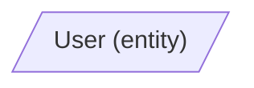

# CGD Response Standard v1.3

## Назначение

Стандарт определяет формат структурированного ответа модели при проектировании программных систем в рамках подхода CGD (Controlled Generative Development). Стандарт обеспечивает сравнимость ответов разных моделей, бинарную проверку полноты и возможность автоматической верификации.

## Принцип

Стандарт реализует contract-first на уровне коммуникации с моделью. Модель получает контракт на формат ответа до выполнения задачи. Нарушение формата видно без экспертного анализа.

## Структура ответа

Ответ состоит из двух обязательных секций. Каждая секция начинается с заголовка второго уровня (`##`) и содержит один fenced-блок. Текст вне секций не допускается.

| Секция | Формат | Назначение |
| --- | --- | --- |
| Mermaid | `flowchart LR` | Типизированный ориентированный граф: узлы (функции и таблицы), рёбра (`consumes`, `produces`, `reads`, `writes`, `triggers`), визуальная топология системы |
| CGD Specification | JSON | Полное описание системы: функции (YASF-профиль + контракты) и таблицы (CGD Table Schema Profile) |

---

## Секция 1: Mermaid

### Формат

Используется только `flowchart LR`. Другие типы диаграмм Mermaid (`erDiagram`, `sequenceDiagram`, `classDiagram`) не допускаются.

### Типы узлов

Таблицы обозначаются трапецией с префиксом `tbl_` в идентификаторе. Отображаемое имя содержит название таблицы и её вид (`kind`) в скобках:

Функции обозначаются скруглённым прямоугольником с префиксом `fn_` в идентификаторе:

### Типы рёбер

Допустимо ровно пять типов. Тип указывается в подписи на стрелке.

| Тип | Направление | Значение |
| --- | --- | --- |
| consumes | table → function | функция принимает запись как входной артефакт |
| produces | function → table | функция создаёт новую запись |
| reads | table → function | функция читает данные без изменения |
| writes | function → table | функция добавляет или обновляет запись |
| triggers | function → function | функция вызывает другую функцию |

### Запрещённые комбинации

- Ребро `table → table` не допускается.
- Ребро `function → function` допускается только с типом `triggers`.
- Ребро `triggers` не может вести в таблицу.

### Правила идентификаторов

Идентификатор узла формируется по схеме: префикс (`tbl_` или `fn_`) + имя в `snake_case`. Отображаемое имя — в `PascalCase`. Это разделение обеспечивает стабильность идентификаторов при нормализации имён.

---

## Секция 2: CGD Specification

### Формат

Один JSON-объект с двумя обязательными ключами верхнего уровня: `functions` и `tables`.

### Блок `functions`

Ключ — имя функции в `PascalCase`. Значение — объект с полями YASF-профиля.

#### Поля YASF-профиля функции

| Поле | Тип | Обязательно | Описание |
| --- | --- | --- | --- |
| `purpose` | string | да | Одно предложение — что делает функция |
| `processing` | array of string | да | Упорядоченный список шагов обработки; каждый элемент — одно действие, одна строка |
| `input` | object | да | Содержит `consumes` и `reads` |
| `input.consumes` | object | да | Ключ — имя таблицы, значение — короткая строка-описание того, что потребляется. Пустой объект `{}` если ничего не потребляется |
| `input.reads` | object | да | Ключ — имя таблицы, значение — короткая строка-описание того, что читается. Пустой объект `{}` если ничего не читается |
| `output` | object | да | Содержит `produces` и `writes` |
| `output.produces` | object | да | Ключ — имя таблицы, значение — короткая строка-описание того, что создаётся. Пустой объект `{}` если ничего не создаётся |
| `output.writes` | object | да | Ключ — имя таблицы, значение — короткая строка-описание того, что записывается. Пустой объект `{}` если ничего не записывается |
| `errors` | array | да | Массив объектов `{condition, result}`. Пустой массив `[]` если ошибок нет |
| `triggers` | array | да | Массив объектов `{function, condition}`. Пустой массив `[]` если триггеров нет |
| `contract` | object | да | Шестикомпонентный контракт `C(f)` |

#### Контракт `C(f)`

| Компонент | Тип | Описание |
| --- | --- | --- |
| `Cin` | array of string | Таблицы, которые функция потребляет |
| `Cout` | array of string | Таблицы, которые функция производит |
| `R` | array of string | Таблицы, которые функция читает |
| `W` | array of string | Таблицы, в которые функция пишет |
| `Tin` | array of string | Функции, которые вызывают данную через `triggers` |
| `Tout` | array of string | Функции, которые данная вызывает через `triggers` |

Пустое множество обозначается пустым массивом `[]`. Все контрактные массивы трактуются как множества: порядок элементов незначим, дубликаты запрещены.

Контракт может быть задан явно или выведен из графа. Если заданы оба — они должны совпадать. Контракт замкнут, если все шесть компонентов определены и соответствуют рёбрам графа.

### Блок `tables`

Ключ — имя таблицы в `PascalCase`. Значение — объект в формате CGD Table Schema Profile.

#### CGD Table Schema Profile

Профиль основан на JSON Schema с CGD-расширениями через префикс `x-`.

##### Соответствие типов CGD → JSON Schema

| Тип CGD | JSON Schema type | JSON Schema format | Примечание |
| --- | --- | --- | --- |
| `text` | `string` | — | |
| `number` | `number` | — | `integer` допустим как refinement-форма |
| `bool` | `boolean` | — | |
| `date` | `string` | `date-time` | |
| `enum(values)` | `string` | — | + поле `enum` с массивом допустимых значений |
| `ref(table)` | совпадает с типом целевого PK | совпадает с форматом целевого PK | + поле `x-fk` |

##### Стандартные поля JSON Schema

| Поле | Описание |
| --- | --- |
| `properties` | Объект с описанием полей таблицы |
| `required` | Массив имён обязательных полей |
| `type` (внутри `properties`) | Тип поля: `string`, `integer`, `number`, `boolean` |
| `format` | Формат поля: `uuid`, `email`, `date-time`, `uri` |
| `enum` | Массив допустимых значений перечислимого поля |

##### CGD-расширения

Расширения делятся на два уровня.

Table-level extensions — указываются на уровне объекта таблицы, рядом с `properties` и `required`:

| Поле | Обязательно | Описание |
| --- | --- | --- |
| `x-kind` | да | Вид таблицы (см. допустимые значения ниже) |
| `x-pk` | да | Имя поля первичного ключа (только `single-field` в v1) |

Field-level extensions — указываются внутри `properties`, на уровне конкретного поля:

| Поле | Обязательно | Описание |
| --- | --- | --- |
| `x-fk` | нет | Ссылка на поле другой таблицы в формате `"Таблица.поле"` (только `single-field` в v1) |
| `x-unique` | нет | Уникальность значения поля в таблице (`true/false`) |

##### Виды таблиц (`x-kind`)

| Kind | Назначение |
| --- | --- |
| `entity` | Основной объект предметной области |
| `event` | Факт, произошедший в системе |
| `reference` | Справочник |
| `log` | Журнал действий |
| `projection` | Производная или агрегатная таблица |
| `error` | Описание ошибки |

##### Правило enum-совместимости

Если таблица-продюсер записывает enum-поле, а таблица-потребитель его читает, должно выполняться:

`Allowed(продюсер) ⊆ Allowed(потребитель)`

Потребитель должен принимать все значения, которые продюсер может создать.

---

## Правила именования

| Элемент | Формат | Примеры |
| --- | --- | --- |
| Имя функции | `PascalCase`, глагол + существительное | `RegisterUser`, `SendConfirmation` |
| Имя таблицы | `PascalCase`, существительное в единственном числе | `User`, `AuditLog`, `RegistrationRequest` |
| Идентификатор узла в Mermaid | `snake_case` с префиксом `tbl_` или `fn_` | `tbl_user`, `fn_register_user` |
| Имя поля таблицы | `snake_case` | `id`, `email`, `created_at`, `error_type` |
| Значение enum | `snake_case` | `active`, `pending`, `invalid_email` |

---

## Согласованность секций

### Кросс-секционная согласованность Mermaid ↔ JSON

1. Каждая функция из блока `functions` присутствует как узел `fn_` в Mermaid.
2. Каждая таблица из блока `tables` присутствует как узел `tbl_` в Mermaid.
3. Нет узлов функций в Mermaid, отсутствующих в блоке `functions`.
4. Нет узлов таблиц в Mermaid, отсутствующих в блоке `tables`.
5. `kind`, указанный в подписи узла таблицы в Mermaid, совпадает со значением `x-kind` в блоке `tables`.
6. Каждое ребро `consumes(T, F)` в Mermaid означает, что `T ∈ Cin(F)`.
7. Каждое ребро `produces(F, T)` в Mermaid означает, что `T ∈ Cout(F)`.
8. Каждое ребро `reads(T, F)` в Mermaid означает, что `T ∈ R(F)`.
9. Каждое ребро `writes(F, T)` в Mermaid означает, что `T ∈ W(F)`.
10. Каждое ребро `triggers(F1, F2)` в Mermaid означает, что `F2 ∈ Tout(F1)` и `F1 ∈ Tin(F2)`.
11. Нет таблиц в контрактах, отсутствующих в блоке `tables`.
12. Нет функций в `triggers`, отсутствующих в блоке `functions`.
13. Отображаемое имя функции в Mermaid совпадает с ключом в `functions` после нормализации имени.
14. Отображаемое имя таблицы в Mermaid совпадает с ключом в `tables` после нормализации имени.

### Внутренняя согласованность CGD Specification

15. Множество ключей `input.consumes` совпадает с множеством `Cin` в `contract`.
16. Множество ключей `input.reads` совпадает с множеством `R` в `contract`.
17. Множество ключей `output.produces` совпадает с множеством `Cout` в `contract`.
18. Множество ключей `output.writes` совпадает с множеством `W` в `contract`.
19. Множество значений `triggers[*].function` совпадает с множеством `Tout` в `contract`.

---

## Слои представления

| Слой | Формат | Назначение |
| --- | --- | --- |
| Ответ модели | Mermaid + JSON | Структурированный вывод, сравнимый между моделями |
| Канонический | `graph.json` + `tables.json` | Нормализованный источник истины для автоматической проверки |
| Визуальный | Mermaid render | Наглядное представление для человека (GitHub, VS Code, статья) |

Модель отвечает в первом слое. Нормализация переводит во второй. Визуализация — в третий. Каждый слой решает свою задачу.

---

## Границы стандарта

Стандарт обеспечивает структурную сравнимость и верифицируемость ответов. Стандарт не гарантирует семантическую корректность — правильность выбора функций, таблиц и связей остаётся ответственностью автора или верификатора.

---

## Версионирование

Версия: `v1.3`  
Дата: `2026-03-15`

Изменения относительно v1.2:
- Таблица типов выровнена с формальным ядром статьи: убран `id`, `integer` трактуется как refinement для `number`, `ref(table)` обобщён
- Явное разделение `table-level` и `field-level` расширений
- Добавлена внутренняя согласованность JSON (правила `15–19`)
