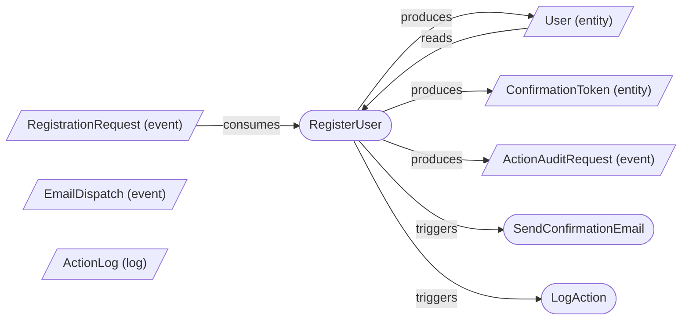
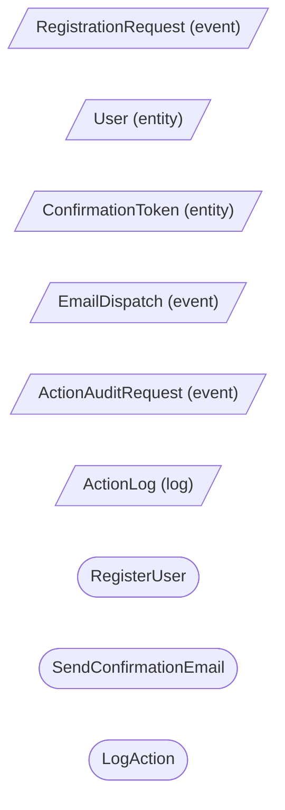
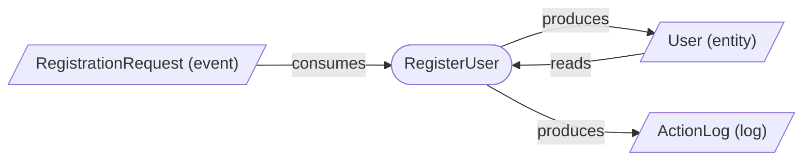

# Controlled Generative Development: от намерения к структурной реализации и подготовке к управляемому исполнению

## Аннотация

В статье предлагается новая постановка задачи для AI-native разработки, в которой центральным объектом до генерации кода становится не промпт и не код, а **структурная реализация** задачи. Мы описываем CGD через архитектурную рамку **Intent → Structural Realization → Execution** и через верхнеуровневую двойку **D = ⟨I, R⟩**, где **I** обозначает представление намерения, а **R** — структурную реализацию. Для CGD формальное ядро второго элемента задаётся тройкой **R = ⟨G, Σ, C⟩**: типизированным графом функций и таблиц, сигнатурами таблиц и контрактами функций. Такая постановка позволяет отделить свободный интерфейс намерения от строгого слоя, пригодного для проверки, анализа, модификации и подготовки к передаче в исполнительные backend’ы. Центральный тезис работы состоит в том, что практическая управляемость в AI-assisted разработке начинается не с усложнения входного промпта, а с фиксации **выхода модели** через output contract, ограничение уровня абстракции и verification profile. На трёх демонстрациях показывается, что output contract делает архитектурные пропуски наблюдаемыми, abstraction control уменьшает дрейф уровня описания, а verification-driven dialogue позволяет довести структурную реализацию до specification closure до генерации кода. Работа подаётся как концептуальная и архитектурная: мы не заявляем завершённую промышленную реализацию, а предлагаем формальный каркас и объясняем, почему он задаёт правильный класс задач для дальнейшей реализации.

## Ключевые слова

controlled generative development; structural realization; output contract; pre-code verification; verification-driven dialogue; task-driven context assembly; abstraction control; AI-native software design

## 1. Введение

Генеративные модели резко снизили стоимость получения кода, но не решили более раннюю и более фундаментальную задачу: как удерживать причинную связь между тем, **что хотел автор**, тем, **как это было формализовано**, и тем, **что в итоге исполняется**. В типичном сценарии пользователь пишет свободный запрос, модель возвращает смесь текста, псевдокода, списков и диаграмм, а разработчик вручную пытается восстановить архитектуру решения. В результате самые дешёвые для исправления ошибки — пропущенные ветви, отсутствующие входные артефакты, неявные контракты, разрывы потоков данных — обнаруживаются слишком поздно, уже после их воплощения в коде.

Современные агентные системы, такие как OpenAI Symphony (2026) [1], автоматизируют переход от задачи к коду, но в доступных публичных описаниях этих систем не выделен промежуточный верифицируемый слой между намерением и исполнением. Данная работа адресует именно этот зазор.

Проблема здесь не сводится к тому, что модели «недостаточно умны». Главная проблема в том, что между намерением и кодом часто отсутствует устойчивый слой, пригодный для формальной работы. Свободный ответ модели может быть полезен человеку как набросок, но он неудобен как объект анализа: у него плавающая форма, разная полнота, дрейф уровня абстракции и неявные умолчания. Именно поэтому в такой схеме сложно надёжно сравнивать решения, собирать контекст под конкретное изменение, выявлять дефекты до генерации и передавать одну и ту же спецификацию в разные исполнительные контуры.

Эта статья предлагает сместить центр тяжести. Мы не ставим в центр вопрос «какая модель лучше» и не ищем единственный правильный граф. Вместо этого мы фиксируем слой, в который ответ модели должен быть приведён **до** генерации кода. Такой слой мы называем **структурной реализацией**. Он не является ни свободным описанием намерения, ни исполняемым кодом, но именно он оказывается тем местом, где можно:

- проверять задачу до генерации кода;
- делать пропуски и противоречия наблюдаемыми;
- собирать релевантный контекст под следующее изменение;
- сравнивать и корректировать решения без сведения статьи к соревнованию моделей;
- передавать одну и ту же спецификацию в разные исполнительные backend’ы.

В этом смысле ключевой сдвиг работы состоит не в усложнении входа, а в **фиксации выхода**. Мы утверждаем, что практический прогресс в AI-assisted разработке начинается не там, где пользователь пишет всё более хитрый промпт, а там, где ответ модели обязан лечь в проверяемую и управляемую структуру, в которой неполнота становится наблюдаемой.

Для этого мы предлагаем рамку **Controlled Generative Development (CGD)**. На верхнем уровне она описывается цепочкой **Intent → Structural Realization → Execution**. Архитектурно проект до передачи в backend задаётся двойкой **D = ⟨I, R⟩**, где **I** — представление намерения на интерфейсном уровне, а **R** — структурная реализация. Для CGD формальное ядро второго элемента задаётся тройкой **R = ⟨G, Σ, C⟩**, где **G** — типизированный граф функций и таблиц, **Σ** — сигнатуры таблиц, **C** — контракты функций.

Главный вклад статьи заключается не в утверждении, что найден «единственно правильный граф», и не в сравнении конкретных моделей между собой. Мы показываем другое: если намерение переводится в строгий и проверяемый структурный слой, в котором пропуски становятся наблюдаемыми, то исчезает смешение проблем. Вопросы формы ответа, уровня абстракции, полноты описания, совместимости данных и выбора исполнительного backend’а перестают жить на одном уровне и начинают решаться там, где им и положено решаться.

## 2. Три управляющих контура: output contract, abstraction control, verification profile

### 2.1. Contract-first на уровне коммуникации

CGD реализует contract-first не только на уровне функций и таблиц, но и на уровне общения с моделью. Модель получает не просто задачу, а **контракт на вид ответа**. В этой постановке центральным объектом становится не само содержимое промпта, а пространство допустимых ответов, в которое модель обязана уложиться.

Такой сдвиг важен практически. Пока формат ответа не фиксирован, пользователь и инструмент работают с текстом для чтения. Как только формат ответа становится частью контракта, ответ превращается в данные для анализа. Отсутствующая таблица, незаполненный контракт, неполное описание error-path или плавающий уровень абстракции становятся наблюдаемыми дефектами, а не поводом для догадки.

### 2.2. Output contract

Первый управляющий контур — **output contract**. Он задаёт, **что** должно присутствовать в ответе модели и **как** это сериализуется.

Внутри него полезно различать две подструктуры.

Первая отвечает на вопрос **что требуется**: какие компоненты вообще обязаны быть в ответе. В контексте CGD это функции, таблицы, сигнатуры, контракты и типизированные связи.

Вторая отвечает на вопрос **как это представляется**: какие машинные и человекочитаемые формы используются для передачи результата. Например, одна часть может быть сериализована как структурированный JSON-профиль, а другая — как человекочитаемая графическая проекция.

Это различие принципиально. Оно позволяет не путать содержательные обязательства ответа с конкретным форматом их представления. Output contract не равен одному «формату файла»; он объединяет обязательные компоненты ответа и способ их сериализации.

Конкретная реализация output contract для CGD — CGD Response Standard — приведена в Appendix A.

### 2.3. Abstraction control

Второй управляющий контур — **abstraction control**. Даже если форма ответа фиксирована, модель всё ещё может сильно расходиться по уровню детализации.

Один ответ разобьёт решение на множество микрошагов, другой сожмёт всё в один крупный узел, третий смешает архитектурный и операционный уровни. Поэтому одной фиксации структуры и формы недостаточно. Нужно отдельно ограничивать **разрешающую способность** ответа: top-level архитектура, детализированная декомпозиция, локальный workflow, внутренний шаг функции и т. д.

Важный эффект abstraction control состоит в том, что он не навязывает модели одну архитектуру. Он задаёт только допустимый **уровень описания**, а ось значений остаётся свободной.

Конкретная реализация abstraction control для CGD — Execution Profile — приведена в Appendix B.

### 2.4. Verification profile

Третий управляющий контур — **verification profile**. Он определяет, какие свойства ответа проверяются до генерации кода, какие дефекты считаются блокирующими, что допустимо исправлять автоматически и в какой момент структурная реализация может считаться достаточно полной для передачи в backend.

Verification profile завершает переход от «текста для чтения» к «структуре для работы». Output contract делает ответ обозримым, abstraction control делает его сопоставимым по глубине, а verification profile делает его пригодным для формальной предкодовой проверки.

### 2.5. Почему этих трёх контуров достаточно для первой версии

Эти три контура не пытаются доказать оптимальность архитектуры и не гарантируют семантическую истинность решения. Их задача скромнее, но фундаментальнее: убрать хаос смешанных уровней и перевести ответ модели в пространство, где можно наблюдать полноту, проверять согласованность, задавать корректирующие вопросы и повторно использовать полученную структуру в дальнейшем процессе разработки.

Именно поэтому CGD начинается не с поиска идеальной модели, а с проектирования управляемого пространства ответа.

### 2.6. Позиционирование

К началу 2026 года spec-first подход стал устойчивым индустриальным трендом: академические обзоры систематизируют уровни строгости спецификаций [2], промышленные инструменты — от CodeSpeak [3] и Augment Intent [4] до OpenAI Symphony [1], Cursor Rules [5], Claude Code [6] и GitHub Spec Kit [7] — фиксируют спецификацию как первичный артефакт разработки вместо свободного промпта.

Однако все эти системы адресуют преимущественно одну сторону задачи: переход от спецификации к коду. В доступных публичных описаниях этих систем не выделен отдельный промежуточный верифицируемый слой, на котором саму спецификацию можно проверить, обнаружить в ней структурные дефекты и довести до specification closure **до** генерации кода. CGD адресует именно этот зазор: формальное ядро `R = ⟨G, Σ, C⟩`, output contract, abstraction control и verification profile задают пространство, в котором ошибка ловится до того, как она становится кодом.

## 3. Архитектурная рамка: D = ⟨I, R⟩

### 3.1. Intent и Structural Realization

Верхнеуровневая схема CGD — это не плоский набор равноправных компонентов, а архитектурная пара причина → следствие:

**D = ⟨I, R⟩**.

Первый элемент, **I**, задаёт **намерение**. Здесь пользователь или автор описывает, что именно нужно сделать. В нашей текущей реализации интерфейсным уровнем служит **YASF (Yet Another Structured Format)** — минимальный авторский формат описания намерения. На этом уровне задача фиксируется в терминах предметной области и в тех именах, которые естественны для автора; эти имена и структуры ещё не обязаны совпадать с будущей структурной реализацией. YASF не является формальной реализацией и не задаёт напрямую **G**, **Σ** и **C**; он лишь переводит свободное описание в структурированное интерфейсное представление, пригодное для дальнейшей компиляции. Переход от первого элемента двойки ко второму состоит в том, что описание на YASF компилируется в структурную реализацию **R = ⟨G, Σ, C⟩**, где граф, сигнатуры таблиц и контракты функций уже подчиняются строгим правилам согласованности и верификации. Полная спецификация YASF приведена в Appendix F.

Второй элемент, **R**, задаёт **структурную реализацию** намерения. Это уже не свободное описание, а формальная модель, с которой можно работать автоматически: проверять, анализировать, модифицировать и передавать в исполняющую систему.

### 3.2. Почему двойка нужна, но не заменяет формальное ядро

Двойка **D = ⟨I, R⟩** отвечает на вопрос **где проходит граница между намерением и формализованной реализацией**. Она не предназначена для выражения всех деталей верификации. Формальная работа начинается внутри второго элемента.

Для CGD этот второй элемент имеет конкретную внутреннюю структуру:

**R = ⟨G, Σ, C⟩**.

Поэтому двойка не заменяет тройку. Она ставит её на правильное место. Если этого различия не проводить, легко смешать язык намерения, стандарты представления ответа и саму реализационную модель. В новой постановке таких путаниц нет: D объясняет архитектурную рамку, а R задаёт формальное ядро CGD.

### 3.3. Intent → Structural Realization → Execution

Архитектурная цепочка CGD имеет три звена.

На уровне **Intent** фиксируется задача в удобном для автора интерфейсном виде.

На уровне **Structural Realization** намерение переводится в формальные структуры, пригодные для проверки и анализа.

На уровне **Execution** структурная реализация передаётся в исполняющую систему: генератор кода, интерпретатор, симулятор, аналитический backend или многоагентную систему.

Такая цепочка позволяет развести по разным уровням три часто смешиваемые задачи: описание смысла, его формализацию и его исполнение. Именно это разведение и есть главный архитектурный выигрыш новой версии статьи.

## 4. Формальное ядро CGD: R = ⟨G, Σ, C⟩

### 4.1. Граф G

Граф **G** задаётся как типизированный ориентированный граф

**G = (V, E, src, dst, τ_V, τ_E)**,

где тип вершины удовлетворяет условию

**τ_V(v) ∈ {function, table}**, 

а тип ребра — условию

**τ_E(e) ∈ {consumes, produces, reads, writes, triggers}**.

Базовые допустимые комбинации таковы:

- `consumes`: table → function;
- `produces`: function → table;
- `reads`: table → function;
- `writes`: function → table;
- `triggers`: function → function.

Граф фиксирует архитектурно значимую топологию обработки: какие функции участвуют в процессе, какие таблицы выступают входами, выходами и состояниями, а также какие зависимости между шагами являются триггерными, а не потоками данных.

### 4.2. Сигнатуры таблиц Σ

Сигнатура таблицы **Σ(t)** задаётся как

**Σ(t) = ⟨Fields, Keys, Kind, Constraints⟩**.

Здесь `Fields` описывает поля и их типы, `Keys` — первичные, уникальные и внешние ключи, `Kind` — роль таблицы в модели (`entity`, `event`, `reference`, `log`, `projection`, `error`), а `Constraints` — дополнительные ограничения целостности.

Сигнатуры нужны не как дублирование реляционной схемы ради схемы. Они являются источником типовой информации для проверки совместимости графовых связей и контрактов функций. Если граф говорит, что функция производит таблицу, а сигнатуры показывают, что таблица несовместима с ожидаемой структурой данных, это должно быть обнаружено до генерации кода.

### 4.3. Контракты функций C

Контракт функции **C(f)** задаётся как

**C(f) = ⟨Cin, Cout, R, W, Tin, Tout⟩**,

где:

- `Cin` — таблицы, которые функция потребляет;
- `Cout` — таблицы, которые функция создаёт;
- `R` — таблицы, которые функция читает;
- `W` — таблицы, в которые функция записывает;
- `Tin` — входящие триггерные зависимости;
- `Tout` — исходящие триггерные зависимости.

Внутри контракта символ `R` обозначает reads-компонент функции; в двойке `D = ⟨I, R⟩` тот же символ обозначает всю структурную реализацию, и различение задаётся контекстом.

Контракт функции связывает граф и сигнатуры: он описывает не просто факт существования узла `function`, а то, как этот узел взаимодействует со структурой данных и с другими шагами обработки.

### 4.4. Корневое свойство: проверка до генерации кода

Главное свойство тройки **⟨G, Σ, C⟩** состоит в том, что она позволяет ловить ошибки **до** генерации кода. На этом уровне уже можно обнаруживать:

- отсутствующие входные артефакты;
- пропущенные ветви обработки;
- разрывы потоков данных;
- неполные контракты;
- несовместимые сигнатуры таблиц;
- изолированные или недостижимые элементы;
- смешение уровней абстракции внутри одного ответа.

Это и есть корневое свойство CGD. Структурная реализация нужна не для красивой диаграммы и не для того, чтобы дублировать код. Она нужна потому, что на этом слое ошибка ещё дёшево исправляется.

### 4.5. Триединая задача: исполнять, анализировать, модифицировать

Именно структурная реализация — а не намерение и не код — способна решать три задачи одновременно.

**Исполнять.** Тройка ⟨G, Σ, C⟩ может быть передана в исполняющую систему.

**Анализировать.** Она допускает формальную проверку согласованности, полноты и совместимости.

**Модифицировать.** Она допускает controlled transformations: изменение узлов и связей, обновление контрактов, перестройку структуры данных и смену уровня детализации.

Намерение слишком свободно, чтобы надёжно решать все три задачи. Код слишком детален и слишком привязан к выбранному backend’у. Только промежуточный структурный слой одновременно достаточно строг и достаточно компактен.

### 4.6. Specification as code with legibility

У структурной реализации есть ещё одно важное свойство: она ведёт себя как код, но остаётся более обозримой, чем код. Её можно версионировать, диффить, валидировать, передавать между инструментами и использовать как источник генерации. В то же время она остаётся читаемой на архитектурном уровне: граф показывает топологию, сигнатуры — данные, контракты — интерфейсы обработки.

Именно этот эффект удобно описывать как **specification as code with legibility**.

### 4.7. Contract-preserving transformations

Тройка **⟨G, Σ, C⟩** допускает contract-preserving transformations: локальную декомпозицию подграфа с сохранением внешнего контракта и обратную агрегацию. Например, три микрофункции с совместимыми контрактами могут быть свёрнуты в одну макрофункцию, если внешний контракт подграфа совпадает с контрактом этой макрофункции. Для первой версии статьи важно зафиксировать сам факт существования таких преобразований, потому что он объясняет, почему CGD способен не только хранить структуру, но и работать с разными уровнями её детализации. Полный алгоритм вычисления подграфового контракта и формальные правила таких преобразований вынесены в Appendix C.

## 5. Verification-driven dialogue и specification closure

### 5.1. Verification profile как рабочий механизм

Verification profile в CGD — это не абстрактная идея «что-нибудь проверить перед кодом». Это конкретный рабочий механизм, который сочетает автоматические проверки, классификацию дефектов и адресный диалог с автором.

Как только ответ модели приведён к тройке **⟨G, Σ, C⟩**, система получает возможность не только валидировать формат, но и задавать содержательные вопросы о неполноте структуры.

### 5.2. Классы дефектов

Дефекты делятся на три класса.

**Blocking.** Дефекты, которые невозможно устранить без решения автора. Например, отсутствующий error-path, неопределённый входной артефакт или принципиально неполный контракт функции.

**Auto-resolvable.** Дефекты, которые можно исправить автоматически без изменения семантики. Например, нормализация имён, слияние алиасов по заранее заданному правилу, канонизация обозначений типов, удаление структурных дублей.

**Advisory.** Замечания, которые не блокируют продвижение, но указывают на потенциальную проблему: неподтверждённая избыточность, необязательный непокрытый downstream-шаг, неиспользуемый success-event, неполное журналирование и т. п.

Такое разделение важно потому, что оно не смешивает техническую нормализацию, содержательные пробелы и архитектурные рекомендации.

### 5.3. Verification-driven dialogue

Когда верификатор обнаруживает blocking-дефект, он не пытается молча «догадаться за автора». Вместо этого он порождает **адресный вопрос**, сформулированный на естественном языке. Ответ автора обновляет структурную реализацию, после чего проверка запускается повторно.

Эта петля и называется **verification-driven dialogue**. Она переводит верификацию из режима «модель выдала текст, человек сам заметил проблему» в режим «система локализует дефект, задаёт вопрос там, где автоматическое исправление недопустимо, и продолжает процесс после получения ответа».

### 5.4. Specification closure

Спецификация считается достигшей **specification closure**, когда выполнены все следующие условия:

1. структурная реализация согласована: граф, сигнатуры и контракты не противоречат друг другу;
2. все обязательные компоненты контрактов определены;
3. отсутствуют нерешённые blocking-дефекты;
4. обязательные пути обработки, включая error-handling, имеют явное структурное выражение;
5. все advisory-замечания либо устранены, либо явно приняты как допустимые в рамках текущего verification profile.

Важно, что specification closure — это не свойство одного уровня и не признак «идеальности архитектуры». Это **достаточное состояние** для перехода к следующему этапу: генерации кода, симуляции или другой исполнительной обработке.

## 6. Task-driven context assembly

Task-driven context assembly в CGD строится не по всей истории чата и не по общей embedding-близости, а по затронутым объектам структурной реализации. Получив новую задачу, система сначала локализует её в **R = ⟨G, Σ, C⟩**: находит функции, таблицы, контракты и ближайшую зависимостную окрестность, которых касается изменение. Затем именно эти объекты используются как ключи для поиска дополнительной информации в истории взаимодействия — отложенных решений, пожеланий автора, спорных мест и правил, которые ещё не были полностью материализованы в текущей реализации.

Например, если приходит задача «добавить журналирование ошибок регистрации», система находит функцию регистрации, её контракт, связанные таблицы error-path и ближайший журналирующий sink. После этого по тем же объектам поднимается история: может выясниться, что две недели назад автор уже зафиксировал пожелание логировать ошибки отдельно от success-path, но оно так и не было внесено в структуру. В контекст попадает текущее состояние затронутых объектов, их локальная окрестность и найденное историческое решение. Такой механизм делает контекст компактным, актуальным и привязанным к единственному источнику правды — структурной реализации; полная формализация вынесена в Appendix D.

## 7. Demo 1 — управление формой

### 7.1. Постановка

Берётся один и тот же запрос о регистрации пользователей. В первом прогоне он подаётся без output contract. Во втором — с явно заданным output contract, который требует вернуть функции, таблицы, сигнатуры, контракты и типизированную проекцию связей в фиксированной форме.

Для демонстрации эффекта формы используются ответы разных моделей; сравнение моделей между собой не является целью данного демо. Напротив, в Demo 2 используется одна и та же модель, чтобы изолировать влияние одного фактора — уровня абстракции.

### 7.2. Реальный baseline-фрагмент

Ниже приведён дословный фрагмент baseline-ответа Claude Opus 4.6 без структурирующего output contract:

````markdown
## Функции

### 1. `register_user(email, password) → User`

Создаёт пользователя и запускает подтверждение.

```text
Вход:  email: str, password: str
Выход: User (id, email, is_verified, created_at)
Ошибки: ValueError — email занят или невалиден

Логика:
  1. validate_email(email)
  2. hash = hash_password(password)
  3. INSERT INTO users (email, password_hash)
  4. token = create_verification_token(user.id)
  5. send_verification_email(email, token)
  6. log_action(user.id, 'register', {ip})
  7. return user
```
````

Этот фрагмент показателен тем, что в нём смешаны интерфейс функции, логика, ошибки и побочные эффекты, но отсутствует явное разделение между графом, данными, контрактом и downstream-зависимостями. Пропуски остаются неявными: нельзя формально проверить, существует ли отдельный входной артефакт, как материализуется error-path и какие таблицы выступают выходами обработки.

### 7.3. Реальный structured-фрагмент

Ниже приведены дословные фрагменты из структурированного прогона GPT-5.4 с output contract: сначала графическая проекция, затем контракт основной функции.

````markdown

````

```json
"contract": {
  "Cin": [
    "RegistrationRequest"
  ],
  "Cout": [
    "User",
    "ConfirmationToken",
    "ActionAuditRequest"
  ],
  "R": [
    "User"
  ],
  "W": [],
  "Tin": [],
  "Tout": [
    "SendConfirmationEmail",
    "LogAction"
  ]
}
```

Здесь пропуск уже нельзя спрятать в свободном тексте: если у функции пустой `Cin`, если не задан `x-kind` или если error-path существует только на словах, это становится наблюдаемым дефектом структуры, а не вопросом интерпретации.

### 7.4. Вывод из Demo 1

Смысл первой демонстрации не в том, что output contract делает модель «умнее». Он делает её ответ **пригодным для работы**. Ответ перестаёт быть текстом для чтения и становится структурой для анализа.

## 8. Demo 2 — управление абстракцией

### 8.1. Постановка

Во втором демо используется тот же output contract, но меняется ограничение по уровню абстракции. Для честного сравнения берутся два ответа одной и той же модели GPT-5.4 на одну и ту же задачу: исходный structured-прогон без явного top-level ограничения и отдельный прогон с требованием максимально упростить граф до top-level представления.

### 8.2. Реальный фрагмент без ограничения уровня

Ниже приведён дословный фрагмент из исходного structured-прогона GPT-5.4 без ограничения уровня абстракции:

````markdown

````

Даже этот короткий фрагмент показывает, что модель естественным образом раскладывает решение на несколько функций и шесть таблиц, включая отдельные шаги подтверждения и журналирования.

### 8.3. Реальный фрагмент с ограничением уровня

Ниже приведён дословный фрагмент из отдельного прогона GPT-5.4 с требованием максимально упростить граф до top-level представления:

````markdown

````

```json
"contract": {
  "Cin": [
    "RegistrationRequest"
  ],
  "Cout": [
    "User",
    "ActionLog"
  ],
  "R": [
    "User"
  ],
  "W": [],
  "Tin": [],
  "Tout": []
}
```

Во втором ответе отдельные узлы `SendConfirmationEmail`, `LogAction`, `ConfirmationToken`, `EmailDispatch` и `ActionAuditRequest` исчезают из top-level представления; соответствующие действия остаются на уровне смыслового описания и processing, но верхняя структурная проекция сжимается до одного макрошага регистрации.

### 8.4. Вывод из Demo 2

Вторая демонстрация показывает, что одной фиксации формы недостаточно. Чтобы работать со структурной реализацией дальше, нужно управлять ещё и уровнем абстракции. Output contract и abstraction control работают как взаимодополняющая пара.

## 9. Demo 3 — verification-driven correction toward closure

### 9.1. Постановка

В третьем демо берётся один из структурированных ответов, полученных после Demo 1 и Demo 2, и пропускается через verification profile. Цель демонстрации — не довести ответ до заранее заданного жёсткого канона, а показать, как structured output превращается в объект проверки и корректировки до достижения specification closure.

Полные артефакты демо-прогонов приведены в Appendix E.

### 9.2. Первый прогон верификатора

В реальном прогоне GPT-5.4 основной обработчик `RegisterUser` уже имеет явный входной артефакт `Cin = ["RegistrationRequest"]`, поэтому дефект лежит не в основном шаге регистрации. Верификатор обнаруживает два blocking-дефекта:

1. **Blocking:** у функции `SendConfirmationEmail` пустой `Cin`, хотя шаг отправки письма зависит от структурно невыраженного входного артефакта.
2. **Blocking:** у потока регистрации отсутствует материализованный error-path: ошибка упоминается на смысловом уровне, но не получает отдельного структурного выражения в графе, сигнатурах и контрактах.

Помимо blocking-дефектов, в том же прогоне обнаружены auto-resolvable отклонения нотации: нестандартная форма подписей рёбер Mermaid и значения `format: "text"` / `format: "bool"` в JSON-сигнатурах. Эти отклонения могут быть нормализованы автоматически и не требуют решения автора.

### 9.3. Диалог с автором

По обоим blocking-дефектам система задаёт адресные вопросы:

- какой объект должен считаться явным входным артефактом для `SendConfirmationEmail`;
- каким образом ошибка регистрации должна быть материализована в структурной реализации: отдельной таблицей, событием или другим явно заданным sink’ом.

Ответ автора обновляет тройку ⟨G, Σ, C⟩: в контракт `SendConfirmationEmail` добавляется явный `Cin`, а error-path получает структурное выражение с пересчётом связанных сигнатур и контрактов.

### 9.4. Повторная проверка и closure

Ожидаемый результат повторной проверки таков: после добавления явного входного артефакта в контракт `SendConfirmationEmail` и материализации error-path оба blocking-дефекта могут быть сняты. В данной версии статьи этот второй проход не показан как отдельный сохранённый артефакт; здесь фиксируется структура коррекции и условие, при котором достигается specification closure.

### 9.5. Вывод из Demo 3

Третья демонстрация замыкает основную логику статьи. Output contract даёт структуру, abstraction control удерживает уровень описания, verification profile локализует дефекты, а verification-driven dialogue задаёт механизм, позволяющий довести структурную реализацию до specification closure. В данном демо показан первый проход верификации и структура коррекции; эмпирическая фиксация полного цикла до closure составляет ближайший следующий шаг.

## 10. Ограничения и threats to validity

### 10.1. Ограничения claims

Настоящая работа — концептуальная и архитектурная. Мы не утверждаем, что уже построили полный reference implementation и не заявляем доказанную промышленную эффективность. Статья показывает, как правильно структурировать задачу, а не предъявляет итоговый эксплуатационный отчёт.

Кроме того, output contract не гарантирует оптимальную архитектуру. Он гарантирует другое: делает архитектуру **наблюдаемой, проверяемой и корректируемой до генерации кода**.

### 10.2. Ограничения модели

Формальное ядро CGD покрывает прежде всего класс систем с дискретными потоками данных и явными зависимостями между функциями и таблицами. Полная операционная семантика ветвления, циклов, конкурентности, тайминга и транзакционности в этой версии статьи не исчерпывается.

### 10.3. Threats to construct validity

Опасность здесь состоит в том, что выбранные контуры управления могут выглядеть достаточными для более широкого класса задач, чем они реально покрывают. Мы снижаем этот риск тем, что явно различаем архитектурную рамку **D = ⟨I, R⟩** и формальное ядро **R = ⟨G, Σ, C⟩**, не распространяя claims на все возможные классы вычислительных систем.

### 10.4. Threats to internal validity

Внутренняя валидность ограничена отсутствием полноценной reference implementation. Показанные демонстрации подтверждают архитектурную правдоподобность подхода, но не доказывают, что каждая конкретная реализация verification profile или task-driven context assembly обязательно даст одинаковый практический эффект.

### 10.5. Threats to external validity

Внешняя валидность ограничена тем, что в статье используются задачи, естественно укладывающиеся в граф обработки и таблицы данных. Распространение подхода на иные классы систем потребует дополнительных профилей представления и, возможно, расширения тройки ⟨G, Σ, C⟩.

### 10.6. Threats to reliability

Надёжность результатов зависит от стабильности output contract, правил нормализации и verification profile. Если эти правила остаются неявными или дрейфуют между прогонами, статья теряет одно из своих главных преимуществ — повторяемость структурного уровня. Поэтому output contract, verification profile и правила нормализации должны быть версионированы наравне с самой структурной реализацией. Именно поэтому мы переносим жёсткость из области «удачных промптов» в область явных профилей и правил проверки.

## 11. Future Work

### 11.1. Калибровка output contract и abstraction control

Первое естественное направление дальнейшей работы — калибровка output contract и abstraction control под фиксированные структурные метрики. Если форма ответа уже стандартизована, становится возможной целенаправленная оптимизация промптов и профилей по критериям полноты, согласованности и пригодности к последующей верификации.

### 11.2. Классы эквивалентных решений

Вторая важная задача — определить классы эквивалентных решений. Для практической работы недостаточно различать «буквально совпадает» и «не совпадает». Нужны формальные критерии, позволяющие отличать другой уровень детализации, допустимое структурное преобразование и реальное архитектурное расхождение.

### 11.3. Графовые преобразования и path-based comparison

Третье направление — graph transformations и path-based comparison. Здесь открываются сразу несколько связанных вопросов: допустимые свёртки и развёртки подграфов, преобразования с сохранением контрактов, сравнение реализаций по множеству путей от входов к выходам, а также определение того, какие различия относятся к форме, а какие — к архитектурной сути.

### 11.4. Расширение набора исполнительных backend’ов

Четвёртое направление связано с backend-уровнем. Одна и та же структурная реализация должна быть пригодна не только для кодогенерации, но и для интерпретации, симуляции, аналитики и агентного исполнения. Проверка того, какие свойства тройки ⟨G, Σ, C⟩ должны быть инвариантны между такими backend’ами, представляет самостоятельный исследовательский интерес.

## 12. Заключение

В статье предложена новая постановка задачи для AI-native разработки. Вместо того чтобы рассматривать промпт и код как две конечные точки процесса, мы вводим промежуточный слой — **структурную реализацию**, который и становится главным объектом проверки, анализа и передачи в backend.

На верхнем уровне CGD задаётся архитектурной схемой **Intent → Structural Realization → Execution** и двойкой **D = ⟨I, R⟩**. Внутри CGD структурная реализация определяется тройкой **R = ⟨G, Σ, C⟩**. Такое разделение убирает смешение уровней: интерфейсное описание намерения, формальный слой реализации и исполнительная система больше не конкурируют за одно и то же место в модели.

Три управляющих контура — **output contract**, **abstraction control** и **verification profile** — переводят ответ модели из пространства свободного текста в пространство контролируемой структуры. Output contract делает неполноту наблюдаемой, abstraction control удерживает допустимую глубину описания, verification profile позволяет задавать адресные вопросы и доводить реализацию до specification closure.

Формальное ядро **⟨G, Σ, C⟩** обеспечивает корневое свойство CGD: проверку до генерации кода. Именно на этом слое становится возможной триединая задача — исполнять, анализировать и модифицировать одну и ту же спецификацию. Task-driven context assembly задаёт принцип, согласно которому этот слой нужен не только для верификации, но и для сборки релевантного контекста под следующее изменение. Наконец, архитектурная рамка спроектирована так, чтобы допускать заменяемость backend’ов: одна и та же структурная реализация в принципе пригодна для передачи в кодогенерацию, интерпретацию, симуляцию или многоагентную систему. Проверка этого свойства на практике составляет отдельное направление дальнейшей работы (§11.4).

Мы не утверждаем, что этим уже решена задача корректной генерации программных систем. Но мы утверждаем, что именно такая структуризация правильно формулирует задачу. Она разносит по своим уровням намерение, формализацию и исполнение и тем самым убирает взаимное влияние проблем, которые в обычной AI-assisted разработке оказываются смешаны в одном месте.


## Appendices

**Appendix A — CGD Response Standard.** Материализация output contract: обязательные секции ответа, формат Mermaid-графа, формат JSON для контрактов и сигнатур, перечень Kind. Источник: `cgd-response-standard-v1.md`.

**Appendix B — Execution Profile.** Материализация abstraction control: допустимый уровень детализации, ограничения на граф, правила выбора разрешающей способности. Источник: `execution-profile-v1.md`.

**Appendix C — ComputeSubgraphContract и правила преобразований.** Алгоритм вычисления подграфового контракта, формальные правила декомпозиции и агрегации с сохранением внешнего контракта.

**Appendix D — Task-driven context assembly.** Формализация механизма сборки контекста по объектам структурной реализации.

**Appendix E — Артефакты демо-прогонов.** Полные файлы прогонов: baseline (`runs/scenario-01/claude-opus-4.6.md`), structured (`runs/scenario-02/gpt-5.4-thinking.md`), top-level (`runs/scenario-02-top-level/gpt-5.4-thinking.md`).

**Appendix F — YASF: спецификация интерфейса намерений.** Минимальный авторский формат описания намерений на интерфейсном уровне: секции, правила именования и правила перехода от YASF к структурной реализации. Источник: `yasf-specification.md`.

## References

1. OpenAI. *Symphony*. 2026. URL: https://github.com/openai/symphony
2. Piskala D. B. *Spec-Driven Development: From Code to Contract in the Age of AI Coding Assistants*. arXiv, 2026. URL: https://arxiv.org/abs/2602.00180
3. Breslav A. *CodeSpeak: Software Engineering with AI*. 2026. URL: https://codespeak.dev/
4. Augment Code. *Build with Intent*. 2026. URL: https://www.augmentcode.com/product/intent
5. Cursor. *Rules documentation*. 2026. URL: https://cursor.com/docs/rules
6. Anthropic. *Best Practices for Claude Code*. 2026. URL: https://code.claude.com/docs/en/best-practices
7. GitHub. *Spec-Driven Development with AI: Get Started with a New Open Source Toolkit*. GitHub Blog, 2025. URL: https://github.blog/ai-and-ml/generative-ai/spec-driven-development-with-ai-get-started-with-a-new-open-source-toolkit/
