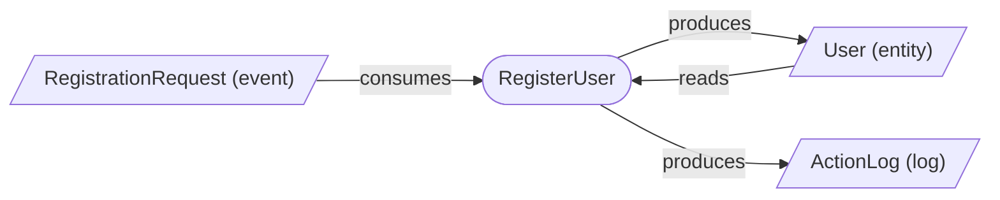

## Prompt
# Scenario 2 Top-Level: standard + abstraction constraint

## Goal

To show that, when response form is fixed, an additional abstraction constraint removes excessive decomposition and brings the model to a top-level representation of the system.

## Prompt

Design a user registration system. Requirements:
- registration by email
- storing user data
- sending a confirmation email
- action logging

Abstraction level: top-level architecture.
Show only the main system functions and their direct inputs/outputs.
Describe auxiliary steps such as validation, password hashing, token generation, email composition, and other internal technical actions in `processing`, not as separate functions or separate tables, unless they are directly required to reflect the main architecture.
Do not add queues, workers, outbox patterns, retry mechanisms, internal helper functions, or technical intermediate entities if they are not needed for the top-level representation.

# Response format

Return the result strictly in two sections. Text outside the sections is not allowed.

## Section 1: Mermaid

Fenced block: ```mermaid

Format: `flowchart LR`

Tables are trapezoids with the `tbl_` prefix:

    tbl_user[/"User (entity)"/]

Functions are rounded rectangles with the `fn_` prefix:

    fn_register_user(["RegisterUser"])

Allowed edge types (must be specified in the edge label):
- `consumes`: `table → function`
- `produces`: `function → table`
- `reads`: `table → function`
- `writes`: `function → table`
- `triggers`: `function → function`

Forbidden: `table → table`, `function → function` without `triggers`.

## Section 2: JSON

Fenced block: ```json

A single object with two keys: `functions` and `tables`.

### functions

The key is the function name (`PascalCase`, verb + noun).  
The value is an object:

```json
{
  "purpose": "one sentence",
  "processing": ["step 1", "step 2", "..."],
  "input": {
    "consumes": { "TableName": "short description" },
    "reads": { "TableName": "short description" }
  },
  "output": {
    "produces": { "TableName": "short description" },
    "writes": { "TableName": "short description" }
  },
  "errors": [
    { "condition": "condition", "result": "result" }
  ],
  "triggers": [
    { "function": "FunctionName", "condition": "condition" }
  ],
  "contract": {
    "Cin": ["tables"],
    "Cout": ["tables"],
    "R": ["tables"],
    "W": ["tables"],
    "Tin": ["functions"],
    "Tout": ["functions"]
  }
}
```

Rules:
- `consumes` / `reads` / `produces` / `writes`: the value must be a short string, not an object
- `processing`: each element must be one action on one line
- `contract`: arrays are treated as sets; order is irrelevant and duplicates are forbidden
- empty fields: `{}` for objects, `[]` for arrays

### tables

The key is the table name (`PascalCase`, singular).  
The value is an object:

```json
{
  "x-kind": "entity | event | reference | log | projection | error",
  "x-pk": "field_name",
  "properties": {
    "field_name": { "type": "type", "format": "format" }
  },
  "required": ["required fields"]
}
```

Field-level extensions (inside `properties`):
- `"x-fk": "Table.field"` — foreign key
- `"x-unique": true` — unique value

`x-pk` and `x-fk` are `single-field` only.

Field types:
- `text` → `string`
- `number` → `number` (`integer` allowed)
- `bool` → `boolean`
- `date` → `string` + `format: date-time`
- `enum` → `string` + `enum: [values]`
- `ref` → target PK type + `x-fk`

Field names and enum values: `snake_case`.

## Section priority

If Mermaid and JSON diverge, JSON is the source of truth.

## Consistency

The sections must be consistent:
- every node in Mermaid = an entry in `functions` or `tables`
- every edge in Mermaid = an element of `contract`
- every element of `contract` = an edge in Mermaid
- `kind` in a Mermaid table label = `x-kind` in `tables`
- keys in `consumes` / `reads` / `produces` / `writes` = corresponding arrays in `contract`
- values in `triggers[*].function` = the `Tout` array in `contract`

## Run protocol

- Use the same base request as in `scenario-02-standard`
- Keep the output contract unchanged
- Add only the top-level abstraction constraint
- Save raw output without editing
- Record: model, date, parameters, scenario

## What we expect to see

- fewer functions;
- collapsed intermediate tables;
- disappearance of non-essential `triggers`;
- preservation of the mandatory task paths at the top level.

## Takeaway for the paper

This scenario shows that the output contract fixes form, but not the depth of description. A separate control loop—`abstraction control`—is required to manage complexity.

## Model response (GPT-5.4-thinking)
# Scenario 2 Top-Level — GPT-5.4-thinking

- model: gpt-5.4-thinking
- date: 2026-03-16
- temperature: 0
- prompt: scenario-02-standard.md + top-level abstraction constraint
- raw: yes (response preserved without editing)

---

## Section 1: Mermaid



## Section 2: JSON

```json
{
  "functions": {
    "RegisterUser": {
      "purpose": "Registers a user by email, stores the user data, initiates confirmation email sending, and records the action in the log.",
      "processing": [
        "Receive the registration request",
        "Check that no user with the same email already exists",
        "Create the user record",
        "Send the confirmation email",
        "Create the log record"
      ],
      "input": {
        "consumes": {
          "RegistrationRequest": "Registration request"
        },
        "reads": {
          "User": "Checking email uniqueness"
        }
      },
      "output": {
        "produces": {
          "User": "New user",
          "ActionLog": "Record of registration and email sending"
        },
        "writes": {}
      },
      "errors": [
        {
          "condition": "email already registered",
          "result": "Registration is rejected"
        },
        {
          "condition": "email is invalid",
          "result": "Registration is rejected"
        }
      ],
      "triggers": [],
      "contract": {
        "Cin": [
          "RegistrationRequest"
        ],
        "Cout": [
          "User",
          "ActionLog"
        ],
        "R": [
          "User"
        ],
        "W": [],
        "Tin": [],
        "Tout": []
      }
    }
  },
  "tables": {
    "RegistrationRequest": {
      "x-kind": "event",
      "x-pk": "registration_request_id",
      "properties": {
        "registration_request_id": {
          "type": "string",
          "format": "uuid"
        },
        "email": {
          "type": "string",
          "format": "email"
        },
        "password_hash": {
          "type": "string",
          "format": "text"
        },
        "created_at": {
          "type": "string",
          "format": "date-time"
        }
      },
      "required": [
        "registration_request_id",
        "email",
        "password_hash",
        "created_at"
      ]
    },
    "User": {
      "x-kind": "entity",
      "x-pk": "user_id",
      "properties": {
        "user_id": {
          "type": "string",
          "format": "uuid"
        },
        "email": {
          "type": "string",
          "format": "email",
          "x-unique": true
        },
        "password_hash": {
          "type": "string",
          "format": "text"
        },
        "email_confirmed": {
          "type": "boolean",
          "format": "bool"
        },
        "created_at": {
          "type": "string",
          "format": "date-time"
        }
      },
      "required": [
        "user_id",
        "email",
        "password_hash",
        "email_confirmed",
        "created_at"
      ]
    },
    "ActionLog": {
      "x-kind": "log",
      "x-pk": "action_log_id",
      "properties": {
        "action_log_id": {
          "type": "string",
          "format": "uuid"
        },
        "user_id": {
          "type": "string",
          "format": "uuid",
          "x-fk": "User.user_id"
        },
        "action_type": {
          "type": "string",
          "enum": [
            "user_registered",
            "confirmation_email_sent"
          ]
        },
        "logged_at": {
          "type": "string",
          "format": "date-time"
        }
      },
      "required": [
        "action_log_id",
        "user_id",
        "action_type",
        "logged_at"
      ]
    }
  }
}
```
