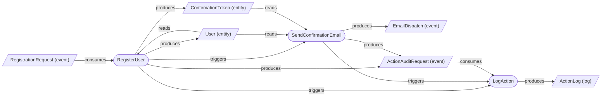

## Prompt

Design a user registration system. Requirements:
- registration by email
- storing user data
- sending a confirmation email
- action logging

Return the response strictly in two sections:
# Response format

Return the result strictly in two sections. Text outside the sections is not allowed.

## Section 1: Mermaid

Fenced block: ```mermaid

Format: `flowchart LR`

Tables are trapezoids with the `tbl_` prefix:

    tbl_user[/"User (entity)"/]

Functions are rounded rectangles with the `fn_` prefix:

    fn_register_user(["RegisterUser"])

Allowed edge types (must be specified in the edge label):
- `consumes`: `table → function`
- `produces`: `function → table`
- `reads`: `table → function`
- `writes`: `function → table`
- `triggers`: `function → function`

Forbidden: `table → table`, `function → function` without `triggers`.

## Section 2: JSON

Fenced block: ```json

A single object with two keys: `functions` and `tables`.

### functions

The key is the function name (`PascalCase`, verb + noun).  
The value is an object:

```json
{
  "purpose": "one sentence",
  "processing": ["step 1", "step 2", "..."],
  "input": {
    "consumes": { "TableName": "short description" },
    "reads": { "TableName": "short description" }
  },
  "output": {
    "produces": { "TableName": "short description" },
    "writes": { "TableName": "short description" }
  },
  "errors": [
    { "condition": "condition", "result": "result" }
  ],
  "triggers": [
    { "function": "FunctionName", "condition": "condition" }
  ],
  "contract": {
    "Cin": ["tables"],
    "Cout": ["tables"],
    "R": ["tables"],
    "W": ["tables"],
    "Tin": ["functions"],
    "Tout": ["functions"]
  }
}
```

Rules:
- `consumes` / `reads` / `produces` / `writes`: the value must be a short string, not an object
- `processing`: each element must be one action on one line
- `contract`: arrays are treated as sets; order is irrelevant and duplicates are forbidden
- empty fields: `{}` for objects, `[]` for arrays

### tables

The key is the table name (`PascalCase`, singular).  
The value is an object:

```json
{
  "x-kind": "entity | event | reference | log | projection | error",
  "x-pk": "field_name",
  "properties": {
    "field_name": { "type": "type", "format": "format" }
  },
  "required": ["required fields"]
}
```

Field-level extensions (inside `properties`):
- `"x-fk": "Table.field"` — foreign key
- `"x-unique": true` — unique value

`x-pk` and `x-fk` are `single-field` only.

Field types:
- `text` → `string`
- `number` → `number` (`integer` allowed)
- `bool` → `boolean`
- `date` → `string` + `format: date-time`
- `enum` → `string` + `enum: [values]`
- `ref` → target PK type + `x-fk`

Field names and enum values: `snake_case`.

## Section priority

If Mermaid and JSON diverge, JSON is the source of truth.

## Consistency

The sections must be consistent:
- every node in Mermaid = an entry in `functions` or `tables`
- every edge in Mermaid = an element of `contract`
- every element of `contract` = an edge in Mermaid
- `kind` in a Mermaid table label = `x-kind` in `tables`
- keys in `consumes` / `reads` / `produces` / `writes` = corresponding arrays in `contract`
- values in `triggers[*].function` = the `Tout` array in `contract`


## Model response (GPT-5.4-thinking)

# Scenario 2 — GPT-5.4-thinking

- model: gpt-5.4-thinking
- date: 2026-03-15
- temperature: 0
- prompt: scenario-02-standard.md
- raw: yes (response preserved without editing)

---

## Section 1: Mermaid



## Section 2: JSON

```json
{
  "functions": {
    "RegisterUser": {
      "purpose": "Registers a user by email, stores the user data, and initiates email confirmation and action auditing.",
      "processing": [
        "Receive a registration request",
        "Check that no user with the same email already exists",
        "Normalize the email and prepare the user data",
        "Create a user record with status pending_confirmation",
        "Generate an email-confirmation token",
        "Create an audit event for registration",
        "Initiate confirmation-email sending",
        "Initiate action logging"
      ],
      "input": {
        "consumes": {
          "RegistrationRequest": "User registration request"
        },
        "reads": {
          "User": "Check email uniqueness"
        }
      },
      "output": {
        "produces": {
          "User": "New user",
          "ConfirmationToken": "Email confirmation token",
          "ActionAuditRequest": "Event for logging the registration"
        },
        "writes": {}
      },
      "errors": [
        {
          "condition": "email already registered",
          "result": "Registration is rejected with duplicate_email"
        },
        {
          "condition": "email has an invalid format",
          "result": "Registration is rejected with invalid_email"
        }
      ],
      "triggers": [
        {
          "function": "SendConfirmationEmail",
          "condition": "The user and confirmation token were created successfully"
        },
        {
          "function": "LogAction",
          "condition": "An audit event for registration was created"
        }
      ],
      "contract": {
        "Cin": [
          "RegistrationRequest"
        ],
        "Cout": [
          "User",
          "ConfirmationToken",
          "ActionAuditRequest"
        ],
        "R": [
          "User"
        ],
        "W": [],
        "Tin": [],
        "Tout": [
          "SendConfirmationEmail",
          "LogAction"
        ]
      }
    },
    "SendConfirmationEmail": {
      "purpose": "Forms and sends a registration-confirmation email to the user.",
      "processing": [
        "Read the user data",
        "Read the active confirmation token",
        "Construct the confirmation link",
        "Assemble the confirmation email",
        "Record the fact that the email was sent",
        "Create an audit event about the email dispatch",
        "Initiate action logging"
      ],
      "input": {
        "consumes": {},
        "reads": {
          "User": "Email recipient data",
          "ConfirmationToken": "Confirmation token and its expiry"
        }
      },
      "output": {
        "produces": {
          "EmailDispatch": "Email sending event",
          "ActionAuditRequest": "Event for logging the email dispatch"
        },
        "writes": {}
      },
      "errors": [
        {
          "condition": "No user found for sending",
          "result": "The email is not sent"
        },
        {
          "condition": "Confirmation token is missing or expired",
          "result": "The email is not sent"
        }
      ],
      "triggers": [
        {
          "function": "LogAction",
          "condition": "An audit event about the email dispatch was created"
        }
      ],
      "contract": {
        "Cin": [],
        "Cout": [
          "EmailDispatch",
          "ActionAuditRequest"
        ],
        "R": [
          "User",
          "ConfirmationToken"
        ],
        "W": [],
        "Tin": [
          "RegisterUser"
        ],
        "Tout": [
          "LogAction"
        ]
      }
    },
    "LogAction": {
      "purpose": "Stores a log record about a system action that has taken place.",
      "processing": [
        "Receive the audit event",
        "Normalize the action type and context",
        "Build the log record",
        "Store the log record"
      ],
      "input": {
        "consumes": {
          "ActionAuditRequest": "Event containing data for logging"
        },
        "reads": {}
      },
      "output": {
        "produces": {
          "ActionLog": "Action log record"
        },
        "writes": {}
      },
      "errors": [
        {
          "condition": "The audit event does not contain mandatory fields",
          "result": "No log record is created"
        }
      ],
      "triggers": [],
      "contract": {
        "Cin": [
          "ActionAuditRequest"
        ],
        "Cout": [
          "ActionLog"
        ],
        "R": [],
        "W": [],
        "Tin": [
          "RegisterUser",
          "SendConfirmationEmail"
        ],
        "Tout": []
      }
    }
  },
  "tables": {
    "RegistrationRequest": {
      "x-kind": "event",
      "x-pk": "registration_request_id",
      "properties": {
        "registration_request_id": {
          "type": "string",
          "format": "uuid"
        },
        "email": {
          "type": "string",
          "format": "email",
          "x-unique": true
        },
        "password_hash": {
          "type": "string",
          "format": "text"
        },
        "full_name": {
          "type": "string",
          "format": "text"
        },
        "requested_at": {
          "type": "string",
          "format": "date-time"
        }
      },
      "required": [
        "registration_request_id",
        "email",
        "password_hash",
        "requested_at"
      ]
    },
    "User": {
      "x-kind": "entity",
      "x-pk": "user_id",
      "properties": {
        "user_id": {
          "type": "string",
          "format": "uuid"
        },
        "email": {
          "type": "string",
          "format": "email",
          "x-unique": true
        },
        "password_hash": {
          "type": "string",
          "format": "text"
        },
        "full_name": {
          "type": "string",
          "format": "text"
        },
        "email_confirmed": {
          "type": "boolean",
          "format": "bool"
        },
        "status": {
          "type": "string",
          "enum": [
            "pending_confirmation",
            "active",
            "blocked"
          ]
        },
        "created_at": {
          "type": "string",
          "format": "date-time"
        }
      },
      "required": [
        "user_id",
        "email",
        "password_hash",
        "email_confirmed",
        "status",
        "created_at"
      ]
    },
    "ConfirmationToken": {
      "x-kind": "entity",
      "x-pk": "confirmation_token_id",
      "properties": {
        "confirmation_token_id": {
          "type": "string",
          "format": "uuid"
        },
        "user_id": {
          "type": "string",
          "format": "uuid",
          "x-fk": "User.user_id"
        },
        "token": {
          "type": "string",
          "format": "text",
          "x-unique": true
        },
        "expires_at": {
          "type": "string",
          "format": "date-time"
        },
        "used": {
          "type": "boolean",
          "format": "bool"
        },
        "created_at": {
          "type": "string",
          "format": "date-time"
        }
      },
      "required": [
        "confirmation_token_id",
        "user_id",
        "token",
        "expires_at",
        "used",
        "created_at"
      ]
    },
    "EmailDispatch": {
      "x-kind": "event",
      "x-pk": "email_dispatch_id",
      "properties": {
        "email_dispatch_id": {
          "type": "string",
          "format": "uuid"
        },
        "user_id": {
          "type": "string",
          "format": "uuid",
          "x-fk": "User.user_id"
        },
        "confirmation_token_id": {
          "type": "string",
          "format": "uuid",
          "x-fk": "ConfirmationToken.confirmation_token_id"
        },
        "email": {
          "type": "string",
          "format": "email"
        },
        "template_code": {
          "type": "string",
          "format": "text"
        },
        "sent_at": {
          "type": "string",
          "format": "date-time"
        },
        "status": {
          "type": "string",
          "enum": [
            "queued",
            "sent",
            "failed"
          ]
        }
      },
      "required": [
        "email_dispatch_id",
        "user_id",
        "confirmation_token_id",
        "email",
        "template_code",
        "sent_at",
        "status"
      ]
    },
    "ActionAuditRequest": {
      "x-kind": "event",
      "x-pk": "action_audit_request_id",
      "properties": {
        "action_audit_request_id": {
          "type": "string",
          "format": "uuid"
        },
        "user_id": {
          "type": "string",
          "format": "uuid",
          "x-fk": "User.user_id"
        },
        "action_type": {
          "type": "string",
          "enum": [
            "user_registered",
            "confirmation_email_sent"
          ]
        },
        "action_status": {
          "type": "string",
          "enum": [
            "success",
            "failure"
          ]
        },
        "message": {
          "type": "string",
          "format": "text"
        },
        "created_at": {
          "type": "string",
          "format": "date-time"
        }
      },
      "required": [
        "action_audit_request_id",
        "action_type",
        "action_status",
        "created_at"
      ]
    },
    "ActionLog": {
      "x-kind": "log",
      "x-pk": "action_log_id",
      "properties": {
        "action_log_id": {
          "type": "string",
          "format": "uuid"
        },
        "action_audit_request_id": {
          "type": "string",
          "format": "uuid",
          "x-fk": "ActionAuditRequest.action_audit_request_id"
        },
        "user_id": {
          "type": "string",
          "format": "uuid",
          "x-fk": "User.user_id"
        },
        "action_type": {
          "type": "string",
          "enum": [
            "user_registered",
            "confirmation_email_sent"
          ]
        },
        "action_status": {
          "type": "string",
          "enum": [
            "success",
            "failure"
          ]
        },
        "message": {
          "type": "string",
          "format": "text"
        },
        "logged_at": {
          "type": "string",
          "format": "date-time"
        }
      },
      "required": [
        "action_log_id",
        "action_audit_request_id",
        "action_type",
        "action_status",
        "logged_at"
      ]
    }
  }
}
```
